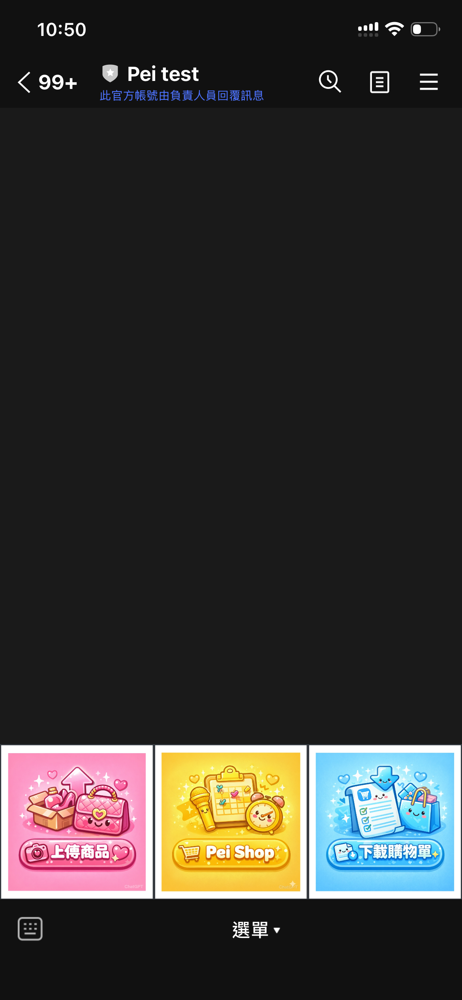
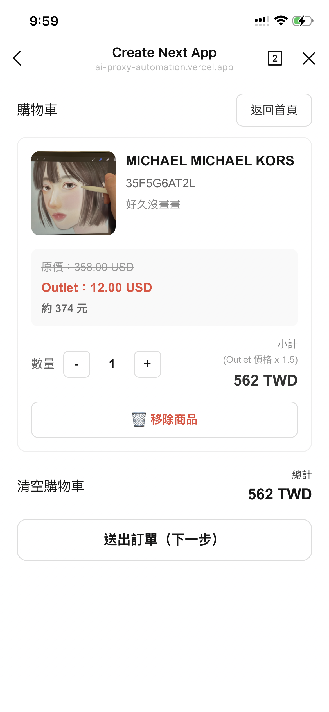

# 🛒 Pei Shop - 購物車系統

整合 LINE LIFF 與 Supabase 的電商購物車系統，使用 Next.js 打造。


## 📱 功能展示

<table>
  <tr>
    <td width="33%" align="center">
      <br/>
      <b>1️⃣ LINE 圖文選單</b><br/>
      <sub>在聊天室點擊「Pei Shop」進入商場</sub>
    </td>
    <td width="33%" align="center">
      <br/>
      <b>2️⃣ 商品展示頁面</b><br/>
      <sub>響應式卡片設計，清楚展示價格與商品資訊</sub>
    </td>
    <td width="33%" align="center">
      <br/>
      <b>3️⃣ 購物車與訂單</b><br/>
      <sub>送出訂單自動觸發 LINE Login 並儲存至資料庫</sub>
    </td>
  </tr>
</table>

---

## ✨ 功能特色

- 🛍️ **商品展示**：響應式網格佈局，支援圖片、價格、庫存顯示
- 🛒 **購物車管理**：本地儲存（localStorage），支援增刪改數量
- 👤 **LINE 登入**：整合 LIFF SDK，自動處理登入流程與用戶資料快取
- 📦 **訂單處理**：與 LINE 用戶綁定，完整的訂單建立流程
- 🖼️ **圖片管理**：Supabase Storage + 批次簽名 URL，優化載入效能

## 🏗️ 技術架構

- **前端**：Next.js 16 (App Router) + React 19 + TypeScript
- **資料庫**：Supabase (PostgreSQL)
- **儲存**：Supabase Storage (私有圖片)
- **認證**：LINE LIFF 2.27
- **樣式**：Tailwind CSS 4

## 📁 專案結構

```
pei-shop/
├── app/
│   ├── page.tsx                    # 商品列表
│   ├── cart/page.tsx               # 購物車
│   └── api/
│       ├── orders/submit/route.ts  # 訂單提交
│       ├── sign/route.ts           # 圖片簽名
│       └── sign-batch/route.ts     # 批次簽名
├── src/lib/
│   ├── cart.ts                     # 購物車邏輯
│   ├── line.ts                     # LINE LIFF
│   ├── supabase.ts                 # Supabase 客戶端
│   ├── signedUrl.ts                # 圖片簽名工具
│   └── fetchProducts.ts            # 商品資料
└── package.json
```

## 🚀 快速開始

### 1. 安裝依賴

```bash
npm install
```

### 2. 環境變數設定

建立 `.env.local` 檔案：

```env
# Supabase
NEXT_PUBLIC_SUPABASE_URL=https://your-project.supabase.co
NEXT_PUBLIC_SUPABASE_ANON_KEY=your-anon-key
SUPABASE_SERVICE_ROLE_KEY=your-service-role-key

# LINE LIFF
NEXT_PUBLIC_LIFF_ID=your-liff-id
```

**取得金鑰：**
- Supabase: [Dashboard](https://app.supabase.com) → Settings → API
- LINE LIFF: [Developers Console](https://developers.line.biz/) → 建立 LIFF App

⚠️ `SUPABASE_SERVICE_ROLE_KEY` 僅供後端使用，勿公開

### 3. 設定 Supabase 資料庫

```sql
-- 商品資料表
CREATE TABLE products (
  product_id TEXT PRIMARY KEY,
  brand TEXT,
  model TEXT,
  description TEXT,
  original_price NUMERIC,
  selling_price_twd NUMERIC,
  outlet_price NUMERIC,
  cover_image_path TEXT,
  cost_twd NUMERIC,
  created_at TIMESTAMP DEFAULT NOW()
);

-- 訂單資料表
CREATE TABLE orders (
  id UUID PRIMARY KEY DEFAULT gen_random_uuid(),
  line_user_id TEXT NOT NULL,
  name TEXT,
  created_at TIMESTAMP DEFAULT NOW()
);

-- 訂單項目資料表
CREATE TABLE order_items (
  id UUID PRIMARY KEY DEFAULT gen_random_uuid(),
  order_id UUID REFERENCES orders(id) ON DELETE CASCADE,
  product_id TEXT REFERENCES products(product_id),
  qty INTEGER NOT NULL CHECK (qty > 0),
  created_at TIMESTAMP DEFAULT NOW()
);

-- 商品視圖（可選）
CREATE VIEW v_products_2_public AS
SELECT product_id, brand, model, description, original_price, 
       selling_price_twd, outlet_price, cover_image_path, cost_twd
FROM products;
```

**設定 Storage：**
1. Supabase Dashboard → Storage
2. 建立 bucket: `product-images`
3. 設為私有（透過簽名 URL 存取）

### 4. 設定 LINE LIFF

1. 前往 [LINE Developers Console](https://developers.line.biz/)
2. 建立 LINE Login Channel → LIFF App
3. 設定：
   - Endpoint URL: `https://your-domain.com` (本地開發用 `http://localhost:3000`)
   - Scope: `profile`, `openid`
4. 複製 LIFF ID 到 `.env.local`

### 5. 啟動開發伺服器

```bash
npm run dev
```

開啟 [http://localhost:3000](http://localhost:3000)

## 📚 核心功能

### 購物車管理

```typescript
import { getCart, addToCart, updateQty, removeFromCart, clearCart } from '@/lib/cart';

addToCart('product-id', 1);      // 加入商品
updateQty('product-id', 3);      // 更新數量
removeFromCart('product-id');    // 移除商品
clearCart();                      // 清空購物車
```

### LINE 登入

```typescript
import { ensureLineLogin, getCachedLineUserId } from '@/lib/line';

// 確保已登入（未登入會自動跳轉）
const profile = await ensureLineLogin();
console.log(profile.userId, profile.displayName);
```

### 圖片簽名 URL

```typescript
// 批次簽名（推薦）
const res = await fetch('/api/sign-batch', {
  method: 'POST',
  body: JSON.stringify({ paths: ['path1.jpg', 'path2.jpg'] })
});
const { signedUrls } = await res.json();
```

## 📝 API 端點

### POST `/api/orders/submit`

提交訂單

```json
// Request
{
  "line_user_id": "U1234...",
  "name": "User Name",
  "items": [{ "product_id": "prod-1", "qty": 2 }]
}

// Response
{ "ok": true, "order_id": "uuid" }
```

### POST `/api/sign-batch`

批次圖片簽名

```json
// Request
{ "paths": ["path1.jpg", "path2.jpg"] }

// Response
{ "signedUrls": { "path1.jpg": "https://...", ... } }
```

## 🚢 部署

### Vercel（推薦）

1. 推送到 GitHub
2. 在 [Vercel](https://vercel.com) 匯入專案
3. 設定環境變數（與 `.env.local` 相同）
4. 部署後更新 LINE LIFF Endpoint URL

### 其他平台

支援 Next.js 的平台皆可：Netlify, AWS Amplify, Railway, Render

## 🛠️ 常見問題

**圖片無法顯示**
- 檢查 Storage bucket 名稱 (`Product-images`)
- 確認圖片路徑正確
- 檢查 Console 錯誤訊息

**LINE 登入失敗**
- 確認 `NEXT_PUBLIC_LIFF_ID` 正確
- LIFF Endpoint URL 需與當前域名一致
- Scope 需包含 `profile` 和 `openid`

**本地開發 HTTPS 問題**
```bash
# LINE LIFF 可能需要 HTTPS，使用 ngrok
npx ngrok http 3000
```

## 📦 建置與檢查

```bash
npm run build    # 建置生產版本
npm start        # 啟動生產伺服器
npm run lint     # 程式碼檢查
```

## 👨‍💻 作者

**Pei**

---

Made with ❤️ using Next.js & Supabase
